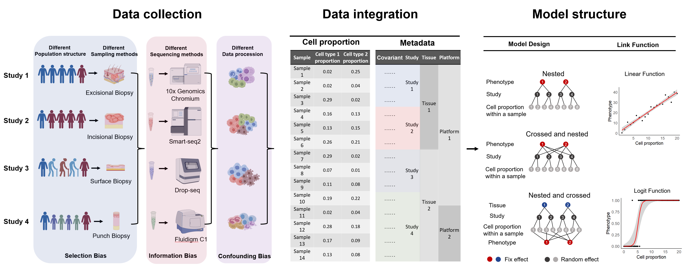
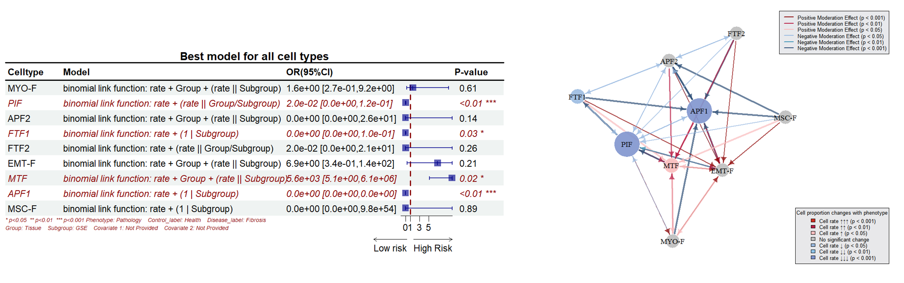
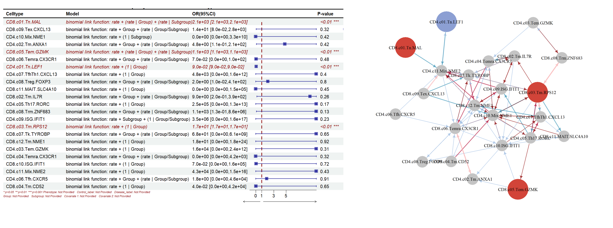
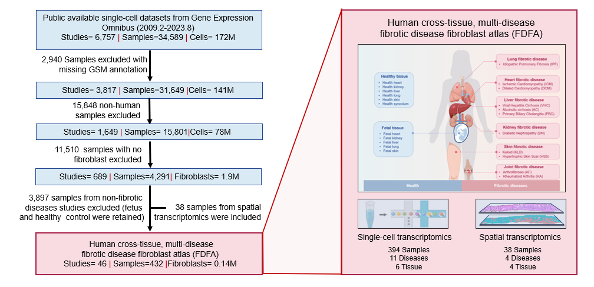

# SPARKLE - Single-cell Phenotype Association Research Kit for Large-scale dataset Exploration <a href='https://github.com/chenxi199506/SPARKLE'></a>

<!-- badges: start -->

SPARKLE is based on generalized linear mixed models (GLMM) for large-scale single-cell cell-phenotype association analysis. SPARKLE supports the flexibly incorporation of metadata variables as covariates to mitigate the impact of heterogeneity on result accuracy.





## Installation of R package

Running the package requires a working R environment (>\=3.5).


### Install from Github using devtools

```
 
if (!requireNamespace("devtools", quietly = TRUE)) {
  install.packages("devtools")
}

devtools::install_github("gao-lab/SPARKLE@master", dep=TRUE, force=TRUE)

```

### Install from R source codes

Download source codes [here](https://github.com/gao-lab/SPARKLE/blob/main/SPARKLE_1.0.1.tar.gz) and type (in R)

```

install.packages(path_to_file, type = 'source', rep = NULL) # The path_to_file would represent the full path and file name (SPARKLE_1.0.1.tar.gz)

```

>Warning: 
For Linux or MacOS users, if cmake is not installed, there might be errors during the installation of lme4 and bruceR dependencies. Please install the following first:

```

conda install -c anaconda cmake
conda install -c conda-forge r-lme4
conda install -c bioconda r-brucer

```


## Capabilities

*   SPARKLE is a model-based toolkit for calling Cell Type–Phenotype Associations across massive heterogenous datasets.

*   By performing precise statistical tests to detect different types of association, SPARKLE enables identification of key cell types associated with particular phenotype(s) with effect sizes (odds ratios, OR) estimated.

*   SPARKLE supports confounding analysis, mediation effect analysis, and masking effect analysis for tool cells, explaining how tool cells influence the association between target cells and phenotypes.

*   SPARKLE further allows moderation effect analysis between cells and generates network diagrams.




## **Tutorials**


SPARKLE provides five real-world cases for users:

[Tutorial 01: Supported Data Input Formats](https://htmlpreview.github.io/?https://github.com/gao-lab/SPARKLE/blob/main/tutorial/00How_to_input_data.html)

[Tutorial 02: Example Case: COVID19 dataset](https://htmlpreview.github.io/?https://github.com/gao-lab/SPARKLE/blob/main/tutorial/02TutorialCOVID.html)

[Tutorial 03: Example Case: MNP dataset](https://htmlpreview.github.io/?https://github.com/gao-lab/SPARKLE/blob/main/tutorial/03TutorialMNP.html)

[Tutorial 04: Example Case: Tcell dataset](https://htmlpreview.github.io/?https://github.com/gao-lab/SPARKLE/blob/main/tutorial/04TutorialTcell.html)

[Tutorial 05: Example Case: Fibroblast dataset](https://htmlpreview.github.io/?https://github.com/gao-lab/SPARKLE/blob/main/tutorial/01TutorialFibroblast.html)

## **Data Source:Fibrotic Disease Fibroblast Atlas (FDFA)**




A cross-tissue, multidisease fibrotic disease fibroblast atlas (FDFA) is publicly available at https://zenodo.org/records/14011564

## Citation

Xi Chen, Yang Ding, Shiqi Yang, Lin Wei, Ming Chu, Hao Tang, Lei Kong, Yixin Zhou, Ge Gao. Identifying Key Cells for Fibrosis by Systematically Calling Cell Type–Phenotype Associations across Massive Heterogenous Datasets. (_in submission_)

## Contact

Email: sparkle@mail.cbi.pku.edu.cn
 
